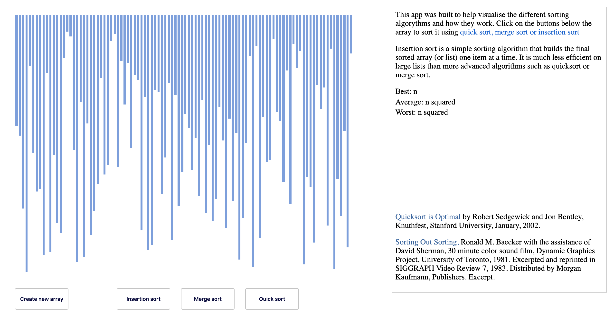

## Sorting Algorithm Visualiser

This project was built to help visualise how different sorting
algorithms work. The sorting algorithms chosen are Quick
sort, Merge sort and Insertion sort.

## Deployment

\*...website

## App in Action

## Build Tools & Languages

- Javascript
- React
- Visual Studio Code
- Git
- Github

## What did I learn?

- Using Hooks in React
- Functional Programming
- Recursive functions

## Authors

Michael Sydney Moore

## References

- Quicksort is Optimal by Robert Sedgewick and Jon Bentley, Knuthfest, Stanford University, January, 2002.
- Sorting Out Sorting, Ronald M. Baecker with the assistance of David Sherman, 30 minute color sound film, Dynamic Graphics Project, University of Toronto, 1981. Excerpted and reprinted in SIGGRAPH Video Review 7, 1983. Distributed by Morgan Kaufmann, Publishers. Excerpt.
